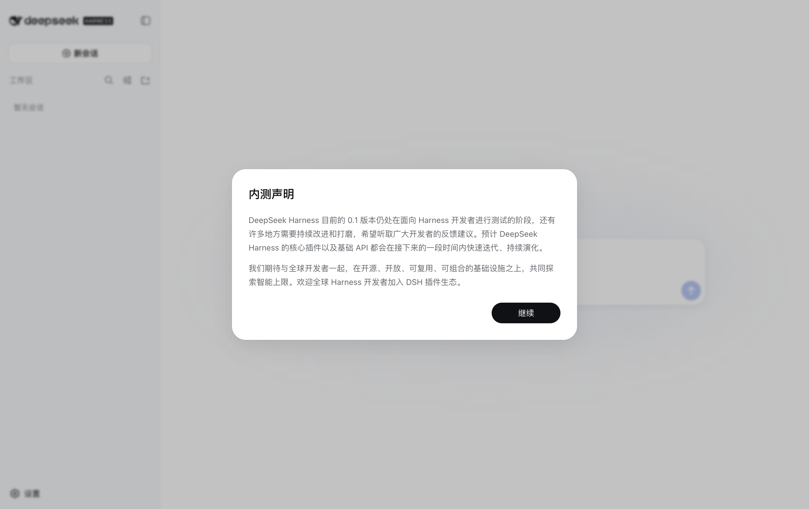
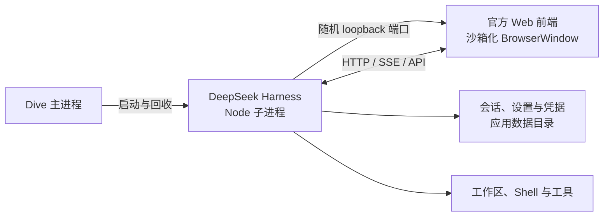

# Dive

中文 | [English](README.en.md)

Dive 是 DeepSeek Harness 的桌面客户端。它把官方 `@deepseek-ai/dsh` 运行时、Web profile 和原有前端一起打包进 Electron 应用；用户启动 Dive 后无需另装 Node.js、npm，也无需手动开放 Web 端口。

> 当前版本依赖 DeepSeek 官方 `@deepseek-ai/dsh@0.1.0-rc.6`。Dive 是社区项目，不是 DeepSeek 官方发行的软件。



## 它如何工作



- 前端不做重写，直接加载 Harness 发布包中的官方 Web UI。
- Harness 只绑定 `127.0.0.1` 的系统随机端口；窗口拒绝跨源导航、非 HTTPS 外链和所有页面权限请求。
- 会话、设置、凭据与插件 profile 存放在 Dive 的应用数据目录，不依赖用户的 `~/.dsh`。
- 关闭应用时先向 Harness 请求优雅退出，给会话持久化和插件清理留出有界时间；超时后终止残留进程。

## 本地开发

要求 Node.js 22.19 或更高版本、pnpm 11.7。

```bash
pnpm install
pnpm run dev
```

第一次启动后，在原有 Harness 设置页中填写 DeepSeek API Key，并从工作区选择器打开代码目录。

## 验证与打包

```bash
pnpm run check
DIVE_SMOKE_SCREENSHOT=/tmp/dive-smoke.png pnpm run test:desktop
pnpm run dist:dir
pnpm run dist
```

推送 `v*` 标签或手动运行 GitHub Actions 的 `Build desktop installers` workflow，会分别构建 macOS arm64/x64、Windows x64 和 Linux x64 安装产物。

## 数据与安全

Dive 不向渲染页面暴露 Node.js 或 Electron API。Electron renderer 开启 sandbox、context isolation 与 web security；所有额外页面权限默认拒绝。Harness 仍然是本地 coding agent，用户批准的 Shell、文件和工具操作可以修改所选工作区，请像使用命令行版 Harness 一样审查权限请求。

应用数据位置由 Electron 的 `userData` 目录决定，Harness 数据位于其 `harness/` 子目录：

- macOS：`~/Library/Application Support/Dive/harness`
- Windows：`%APPDATA%\Dive\harness`
- Linux：`~/.config/Dive/harness`

## 当前限制

- 安装包尚未配置 Apple Developer ID 或 Windows 代码签名；本地构建和 CI 产物可能触发系统的未签名应用提示。
- Electron 包不使用 ASAR。Harness 会在可写数据目录中建立指向安装依赖的模块链接，真实文件路径是它加载 profile 与插件的必要条件。
- Dive 跟随固定的 Harness 预发布版本；升级前需要重新运行生命周期测试和桌面冒烟验证。

## 上游与许可

Dive 基于 [DeepSeek Harness](https://github.com/deepseek-ai/deepseek-harness)，后者与本项目均使用 MIT License。Electron 的进程和安全配置遵循其[官方安全建议](https://www.electronjs.org/docs/latest/tutorial/security)。
